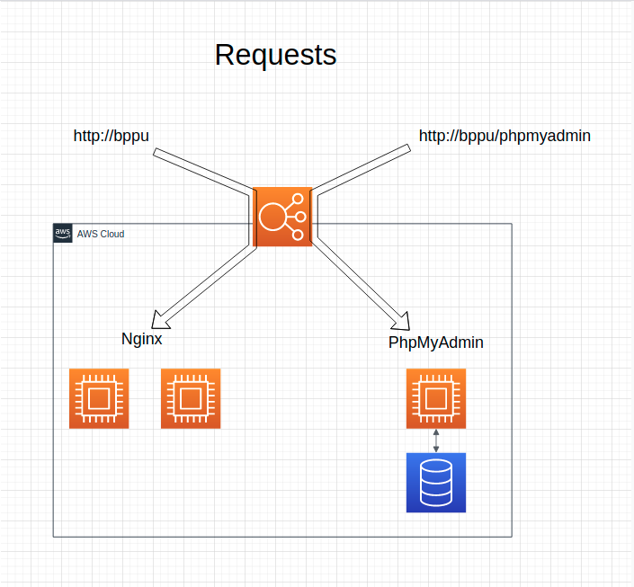

i. This schema has information about architecture of project

ii. What you will do if availability zone is going to break down? \
    You shoult run playbook in Jenkins with another parameters

    a. You could find variable of avalibale zone in git: 
    education/HW_dev_pro/education_terraform/HW_terraform_code_without_modules/variables.tf
    b. You have to change variables: region, subnet_1a, subnet_1b \
    You should set the new region for that variables
    c. After that do git commit
iii. When you finished previous you should just run Jenkins playbook \
Terraform and Ansible would make infrastructure in another region and deploy this application to all instances in AWS

