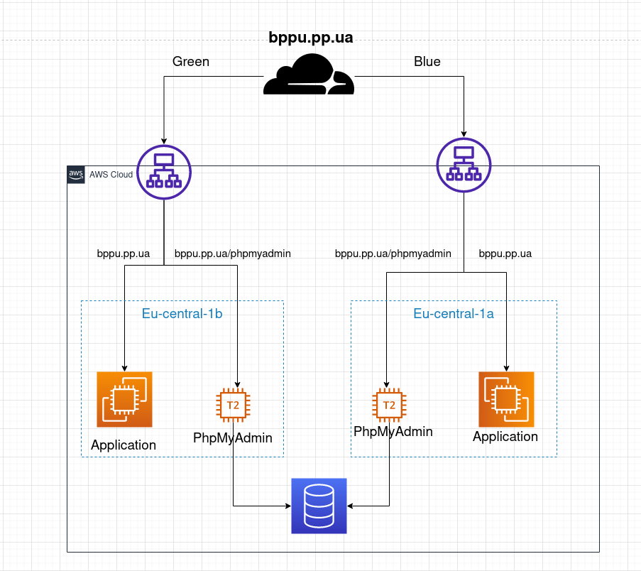

This schema has information about architecture of project

- On the top schema has cloudflare like an orchestrator between green and blue branch.
- After that we can see two load balancers for green and blue branch.
- We can see two available zones behind load balancers. Each zone has an instance with Nginx and phpMyAdmin Application. An instance with phpMyAdmin Application connect to database (MariaDB)

How it works?

i. You should run pipeline_build job in Jenkins. This job has four stages. 
- The first stage is git pull. Download all changes from git repo to Jenkins slave
- The second stage is Asible decrypt secret key
- The third stage is run the Terraform script. This stage build cloud architecture of our project. \
 Before you start this job, should choose the one parameter (green or blue) \
Also after build this stage set DNS record with the load balancer to cloudflare. The DNS record depends on you choice. \
If your choice would be green the DNS record included the "green" load balancer, if your choice would be blue the DNS record included the "blue" load balancer. \
All traffic goes through only one load balancer.
- The last stage is deploy (with Ansible) Nginx, Application and Database to instances, which are made by terraform in previous stage.

ii. If you want to change deploy branch from green to blue you should run the Jenkins job with another parameter (for example blue).
If you do this the first and second stages go quickly. The third stage goes quickly to, because terraform changes only DNS record in cloudflare.

iv. What you will do if availability zone is going to break down? \
    You should change available zone in terraform code (variable.tf file) push your changes to repo and run Jenkins playbook. \
You should change only available zone nothing more. 
